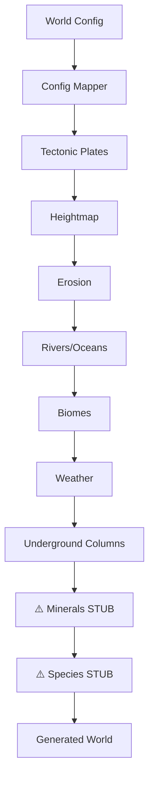

# World Generation Stages

**Package**: `internal/worldgen/`  
**Documentation Version**: 1.0 | December 2025

---

## Table of Contents
1. [Generation Pipeline](#generation-pipeline)
2. [Geology System](#geology-system)
3. [Weather System](#weather-system)
4. [Evolution System](#evolution-system)
5. [Simulation Runner](#simulation-runner)
6. [Known Gaps](#known-gaps)

---

## Generation Pipeline

The orchestrator (`orchestrator/service.go`) coordinates world generation:



### Coverage by Stage

| Stage | Package | File | Coverage |
|-------|---------|------|----------|
| Config Mapping | `orchestrator` | config_mapper.go | 80% |
| Tectonics | `geography` | tectonics.go | 95% |
| Heightmap | `geography` | heightmap.go | 95% |
| Erosion | `geography` | erosion.go | 95% |
| Rivers | `geography` | rivers.go | 95% |
| Biomes | `geography` | biomes.go | 95% |
| Weather | `weather` | service.go | 70% |
| Underground | `underground` | *.go | 86% |
| Minerals | `minerals` | *.go | 85% ⚠️ NOT CALLED |
| Evolution | `evolution` | *.go | 82% ⚠️ NOT CALLED |

---

## Geology System

### Hybrid Column-Based Underground

The underground uses a **column-based** approach (NOT full 3D voxels):
- 1:1 resolution with heightmap
- Per-column data: strata, voids, resources, magma

**File**: `underground/types.go`

```go
type WorldColumn struct {
    X, Y      int
    Surface   float64       // Terrain elevation
    Bedrock   float64       // Deepest mineable depth
    Strata    []StrataLayer // Geological layers
    Voids     []VoidSpace   // Caves, tunnels
    Resources []Deposit     // Minerals, fossils
    Magma     *MagmaInfo    // Active magma
}
```

### Strata by World Composition

| Composition | Layers | Characteristics |
|-------------|--------|----------------|
| `volcanic` | soil→basalt→gabbro→mantle | Low cave potential |
| `continental` | soil→sedimentary→limestone→granite→basalt | Balanced |
| `oceanic` | sediment→limestone→chalk→granite | High caves |
| `ancient` | soil→sandstone→schist→granite | Mineral rich |

### Cave Formation

Caves form through limestone dissolution (`cave_formation.go`):
- Requires high rainfall + porous limestone
- Forms over 100K+ years simulation time
- Creates interconnected chambers and passages

### Magma Simulation

Magma chambers form at tectonic boundaries (`magma_simulation.go`):
- Eruption when pressure ≥ 80 (60 for volcanic worlds)
- 70% chance of lava tube formation on eruption

---

## Weather System

**Package**: `weather/`

### Components

| File | Purpose |
|------|---------|
| evaporation.go | Temperature + water → moisture |
| wind.go | Hadley cell simulation |
| precipitation.go | Moisture + elevation → rain/snow |
| states.go | Clear, cloudy, rain, storm, snow |

### Weather Update Cycle

```go
// Called each simulation tick
states := weather.UpdateWeather(cells, time, season)
```

---

## Evolution System

**Package**: `evolution/`  
⚠️ **Status**: Implemented but NOT integrated with orchestrator

### Components

| File | Purpose |
|------|---------|
| species.go | Species definition and templates |
| fitness.go | Environmental fitness calculation |
| mutation.go | Trait mutation mechanics |
| predation.go | Predator-prey dynamics |
| food_chain.go | Trophic level management |
| competition.go | Resource competition |

---

## Simulation Runner

### Async Runner (`ecosystem/runner.go`)

Commands:
- `world run` — Start/resume async simulation
- `world pause` — Pause simulation
- `world speed <n>` — Set years per tick (1/10/100/1000)

States: `idle` → `running` ⇄ `paused` → `stopping`

### Synchronous Simulation

Command: `world simulate <years> [flags]`

| Flag | Effect |
|------|--------|
| `--epoch <name>` | Label time period |
| `--only-geology` | Skip life simulation |
| `--only-life` | Skip active geology |
| `--no-diseases` | Disable pathogens |

---

## Known Gaps

### Critical Stubs

> [!WARNING]
> These orchestrator functions return empty results:

| Function | Line | Package Available |
|----------|------|-------------------|
| `generateMinerals` | 181-185 | ✅ minerals/ |
| `generateSpecies` | 188-192 | ✅ evolution/ |

### Unimplemented Features

| Feature | Priority | Description |
|---------|----------|-------------|
| Continental Configuration | 8 | Fragmentation → speciation rate |
| Oxygen Cycle | 9 | Flora/fauna → O2 levels → size limits |
| Solar Evolution | 11 | Luminosity increase over billions of years |
| Genetic Code | 5 | 50D genome vector for genotype→phenotype |

### Test Coverage Gaps

- Weather: 70.5% (lowest)
- Minimap/Worldmap: ~60%
- Integration tests: Only 1 (climate impact)

---

## Testing

```bash
# All worldgen tests
go test ./internal/worldgen/... -cover -v

# Ecosystem/runner tests
go test ./internal/ecosystem/... -cover -v

# Map service tests
go test ./internal/game/services/map/... -cover -v
```
