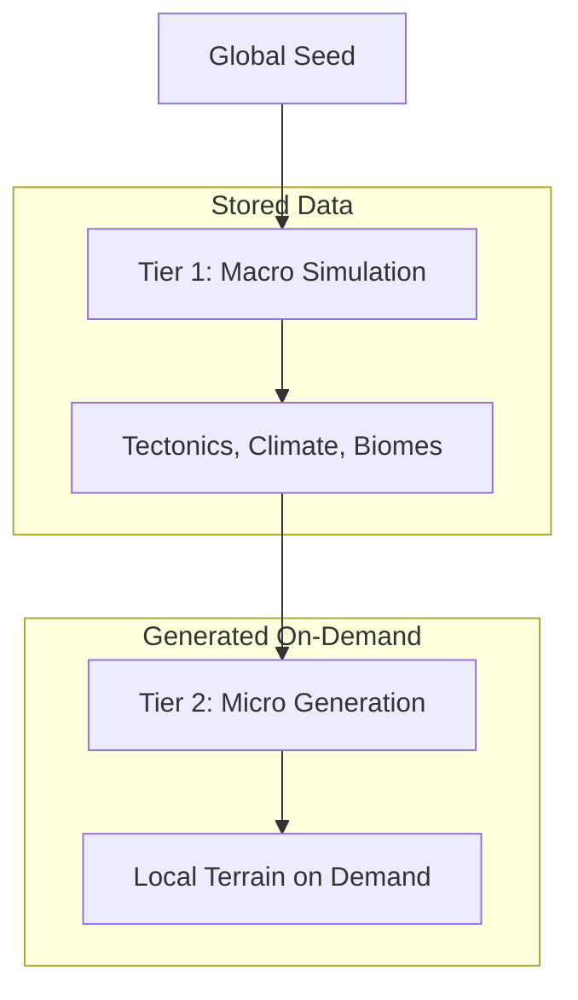

# Infinite Zoom Architecture

> Google Earth-style zoom from orbit to individual NPCs

## Overview

The world simulation uses a **two-tier architecture** enabling seamless zoom from global scale (300km cells) down to NPC scale (1m detail) without storing petabytes of data.



---

## Tier 1: Macro Simulation (Source of Truth)

The existing CubeSphere grid stores persistent world state.

| Property | Value |
|----------|-------|
| Grid | 6 faces × 128×128 = 98,304 cells |
| Cell Size | ~312 km at equator (Earth-scale) |
| Stored | Elevation, Biome, Climate, Plate ID, Resource Seeds |
| Updated | World generation, geological events |

**Coordinate System**: `(Face, X, Y)` where Face ∈ [0..5], X/Y ∈ [0..Resolution-1]

---

## Tier 2: Micro Generation (Fractal Detail)

Generates local terrain **deterministically** from Macro data. Nothing stored—regenerated identically each visit.

### Coordinate Mapping

```
Lat/Lon → Sphere Vector → Face Detection → Cell (X, Y) + Offset (u, v)
```

```go
// GlobalToMacro converts lat/lon to macro cell + local offset
func GlobalToMacro(lat, lon float64) MacroLocation {
    // 1. Convert to 3D sphere point
    x, y, z := LatLonToSphere(lat, lon)
    
    // 2. CubeSphere.FromVector finds Face + Cell
    coord := topology.FromVector(x, y, z)
    
    // 3. Calculate local offset [0, 1) within cell
    // (fractional part from vector projection)
    offsetU, offsetV := CalculateCellOffset(x, y, z, coord)
    
    return MacroLocation{Face: coord.Face, X: coord.X, Y: coord.Y, U: offsetU, V: offsetV}
}
```

### Deterministic Seeding (The Key)

For any location, generate a unique reproducible seed:

```go
func GenerateLocalSeed(globalSeed int64, face, x, y, detailLevel int) int64 {
    h := fnv.New64a()
    binary.Write(h, binary.LittleEndian, globalSeed)
    binary.Write(h, binary.LittleEndian, int32(face))
    binary.Write(h, binary.LittleEndian, int32(x))
    binary.Write(h, binary.LittleEndian, int32(y))
    binary.Write(h, binary.LittleEndian, int32(detailLevel))
    return int64(h.Sum64())
}
```

**Result**: Same inputs → same seed → same procedural content → returning players see same rocks, trees, terrain.

---

## Level of Detail (LOD) System

| LOD | Scale | Resolution | Content |
|-----|-------|------------|---------|
| 0 | 300km | Macro cell | Plate, base elevation, biome |
| 1 | 50km | 6×6 sub-cells | Mountain ranges, major valleys |
| 2 | 1km | 50×50 | Hills, forests, river valleys |
| 3 | 100m | 10×10 | Boulders, clearings, paths |
| 4 | 10m | 10×10 | Individual trees, rock outcrops |
| 5 | 1m | 10×10 | Ground detail, grass patches |

Each level inherits from parent and adds detail using `GenerateLocalSeed(parentSeed, ...)`.

---

## Biome-Influenced Micro Generation

```go
func GetMicroNoiseConfig(biome BiomeType) FBMConfig {
    switch biome {
    case BiomeMountain:
        return FBMConfig{Octaves: 8, Persistence: 0.6, WarpStrength: 0.5}  // Rugged
    case BiomeGrassland:
        return FBMConfig{Octaves: 4, Persistence: 0.3, WarpStrength: 0.2}  // Gentle
    case BiomeDesert:
        return FBMConfig{Octaves: 5, Persistence: 0.4, WarpStrength: 0.6}  // Dunes
    default:
        return DefaultTerrainFBMConfig()
    }
}
```

---

## Implementation Files

| File | Purpose |
|------|---------|
| `geography/zoom.go` | Coordinate mapping, seed generation, LOD system |
| `geography/noise.go` | FBM noise with domain warping |
| `spatial/cube_sphere.go` | ToSphere/FromVector conversion |

---

## Usage Example

```go
// Player teleports to lat=45°, lon=-120°
location := GlobalToMacro(45.0, -120.0)

// Get macro cell data
biome := world.GetBiome(location.Face, location.X, location.Y)
baseElev := world.GetElevation(location.Face, location.X, location.Y)

// Generate local terrain at LOD 3 (100m scale)
localSeed := GenerateLocalSeed(globalSeed, location.Face, location.X, location.Y, 3)
noiseConfig := GetMicroNoiseConfig(biome)
fbm := NewFBMGenerator(localSeed, noiseConfig)

// Sample terrain at player's exact position
microElev := fbm.FBM2D(location.U * 1000, location.V * 1000) * 50.0
finalElev := baseElev + microElev
```
