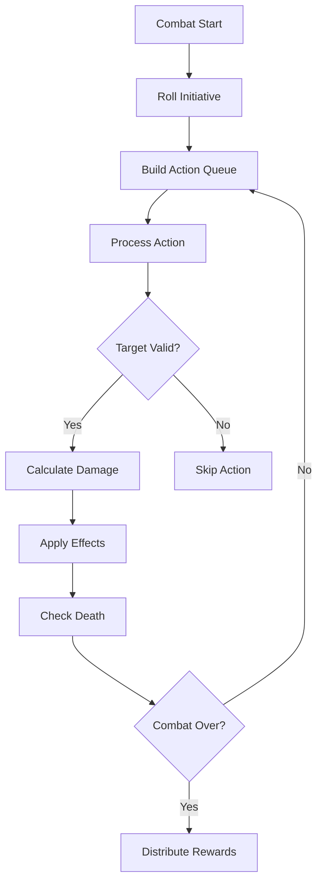

# Combat Package

Turn-based combat system with action queues, damage calculation, and status effects.

## Architecture

```
combat/
├── action/     # Action queue and turn management
├── damage/     # Damage types, resistances, calculations
└── effects/    # Status effects (buffs, debuffs, DoTs)
```

---

## Subsystems

### action/
**Files**: 12 files

Manages combat turn order and action processing:
- **Action Queue**: Priority-based action ordering
- **Turn Management**: Initiative, action points
- **Action Types**: Attack, defend, skill, item, flee

```go
queue := action.NewQueue()
queue.Enqueue(action.Attack{Target: enemyID, Skill: "slash"})
queue.Process() // Executes in priority order
```

---

### damage/
**Files**: 8 files

Damage calculation with types and resistances:

| Damage Type | Description |
|-------------|-------------|
| Physical | Reduced by armor |
| Magical | Reduced by magic resistance |
| True | Ignores all defenses |
| Elemental | Fire, ice, lightning, etc. |

**Formula**:
```
finalDamage = baseDamage * (1 - resistance) * critMultiplier - flatReduction
```

---

### effects/
**Files**: 13 files

Status effect system for buffs, debuffs, and damage over time:

| Effect Category | Examples |
|-----------------|----------|
| Buff | Strength up, haste, shield |
| Debuff | Slow, weakness, blind |
| DoT | Poison, burn, bleed |
| Control | Stun, sleep, fear |

**Features**:
- Duration tracking (ticks/turns)
- Stacking rules (refresh, stack, replace)
- Immunity checks
- Effect interactions

---

## Combat Flow



---

## Integration Points

- **Character Attributes**: `internal/character` provides stats
- **Skills System**: `internal/skills` defines available abilities
- **NPC AI**: `internal/npc/behavior` controls NPC combat decisions
- **Event Store**: Combat events logged for replay

## Testing

```bash
go test ./internal/combat/...
```
