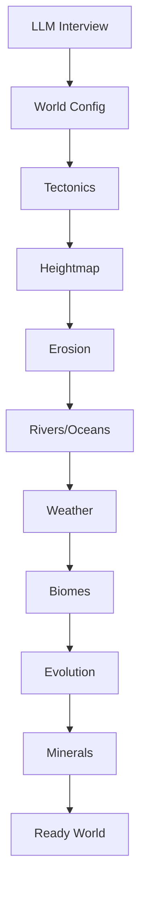

# Worldgen Package

The `internal/worldgen` package implements procedural world generation for Thousand Worlds. It creates unique, realistic worlds through tectonic simulation, terrain generation, weather patterns, and flora/fauna evolution.

## Architecture

```
worldgen/
├── geography/       # Terrain, tectonics, rivers, biomes
├── weather/         # Weather simulation (evaporation, wind, precipitation)
├── underground/     # Hybrid column-based strata and cave simulation
├── evolution/       # Flora/fauna evolution with environmental pressures
├── minerals/        # Resource/ore placement by geology
├── orchestrator/    # Coordinates generation pipeline
└── integration_test/ # E2E generation tests
```

---

## Subsystems

### geography/
Generates realistic terrain through geological simulation.

| File | Description |
|------|-------------|
| `tectonics.go` | Tectonic plate simulation (continental/oceanic) |
| `heightmap.go` | Mountain ranges, valleys, plains via Perlin noise |
| `erosion.go` | Hydraulic and thermal erosion |
| `rivers.go` | River generation via erosion pathfinding |
| `ocean.go` | Ocean/land distribution |
| `biomes.go` | Biome assignment (elevation, latitude, moisture) |
| `volcanism.go` | Volcanic activity at plate boundaries |
| `shapes.go` | World shape handling (spherical, bounded, infinite) |
| `noise.go` | Noise generation utilities |
| `types.go` | WorldGeography, TerrainCell, Biome types |

---

### weather/
Simulates weather patterns based on geography.

**Key Concepts:**
- **Evaporation** - Temperature + water proximity
- **Wind Patterns** - Hadley cell simulation
- **Precipitation** - Moisture + elevation interactions
- **Weather States** - Clear, cloudy, rain, snow, storm

---

### evolution/
Time-accelerated evolution during world creation.

**Features:**
- Species schema (traits, diet, habitat, population)
- Survival mechanics (food chain, predation, competition)
- Environmental adaptation (evolutionary pressure)
- Ecosystem stability balancing

---

### minerals/
Resource placement based on geological realism.

**Distribution by:**
- Biome type
- Volcanic activity
- Tectonic boundaries
- Water proximity

---

### orchestrator/
Coordinates the generation pipeline:

1. Generate tectonic plates
2. Create heightmap
3. Apply erosion
4. Place rivers and oceans
5. Assign biomes
6. Simulate weather patterns
7. Evolve flora/fauna
8. Place mineral resources

---

## Generation Flow



---

## Testing

```bash
# Run all worldgen tests
go test ./internal/worldgen/...

# Run with coverage
go test -cover ./internal/worldgen/...

# Run integration tests
go test -v ./internal/worldgen/integration_test/...
```
